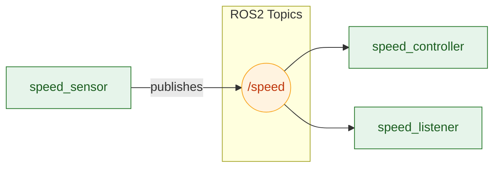
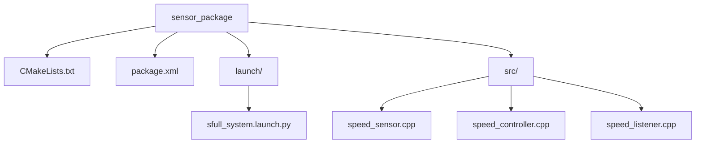

# Sebességfigyelő és Szabályozó

## Főbb Jellemzők

- **Egész Számos Működés:**
A csomag kizárólag `Int32` típusú adatokat használ, elkerülve a lebegőpontos pontatlanságokat.

- **Egyszerű, Determinisztikus Viselkedés:**
A sebesség minden másodpercben kiszámíthatóan növekszik, és a vezérlő valós időben reagál.

- **Valós Idejű Publikáció és Feliratkozás:**
A node-ok közti kommunikációt ROS 2 topicok biztosítják, a `std_msgs/msg/Int32` típus használatával.

- **Moduláris Felépítés:**
Három, jól elkülönített node kezeli az érzékelést, vezérlést és megfigyelést.

---

## Rendszerarchitektúra

A rendszer két fő komponensből áll, amelyek **zárt adatfolyamkört** alkotnak:

###  `speed_sensor` (Szenzor)
- Folyamatosan növekvő sebességértékeket generál.
- Publikálja az adatokat a `/speed` topicon.
- Üzenettípus: `std_msgs/msg/Int32`.

###  `speed_controller` (Vezérlő)
- Feliratkozik a `/speed` topicra.
- Fogadja a szenzor adatait, majd feldolgozza és megjeleníti a konzolon.
- A szabályozás jelenleg megfigyelő jellegű, de később arányos vezérlés is építhető rá.

###  `speed_listener` (Hallgató)
- Feliratkozik a `/speed` topicon publikált üzenetekre.
- Célja a szenzor és vezérlő közötti adatfolyam vizualizálása és ellenőrzése.

---

  ##  Adatfolyam Diagram


---

##  Telepítés és Futtatás

###  Build

Navigálj a workspace-be és fordítsd le a csomagot:

```bash
cd ~/ros2_ws
```
```bash
colcon build --packages-select sensor_package 
```
### Source

```bash
  source install/setup.bash
```
### Launch

```bash
   ros2 launch sensor_package full_system.launch.py
```
A sebesség minden másodpercben növekszik, a controller publish-eli. Párhuzamosan a '/speed_listener' is fogadja a sebességet.

---

## Felépítés


	
